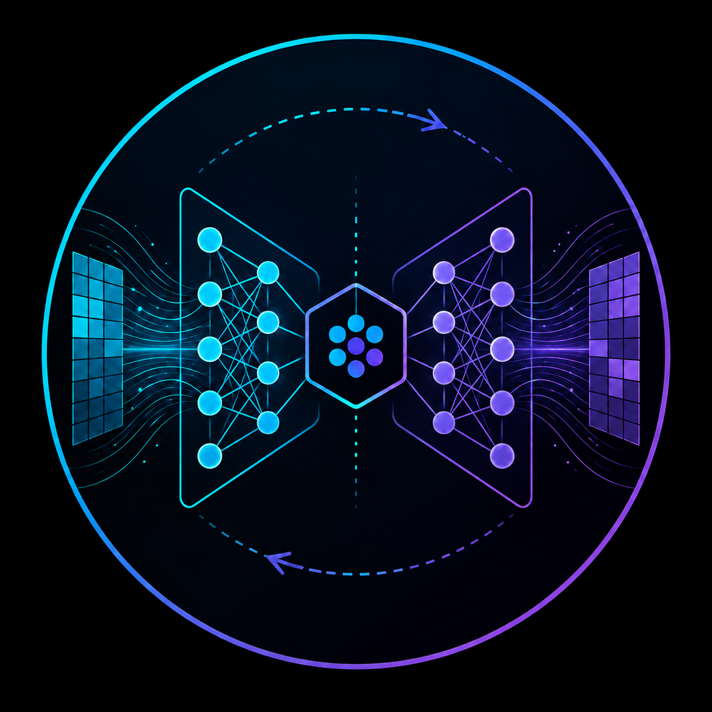

<p align="center">
  
</p>


# Reconstructions

Predicting trainable hyperparameter configurations for untrained neural networks.

The intended use case is the analysis of information accessibility in neural networks: if the representation after a layer still contains input-relevant structure, a reconstruction cascade with comparable local complexity should be able to recover it. If reconstructions collapse, become class-agnostic, or converge toward dataset-level averages, this indicates that the corresponding representation no longer makes the original information easily accessible to downstream layers.

## Typical workflow
The ```hyperparameter_search.ipynb```.notebook provides code examples for MLPs on MNIST and CNNs on CIFAR10. 
The general workflow is as follows:
1. Define a normal PyTorch model.
2. Pass an example batch to `get_conet_layout` to derive reconstruction-compatible forward blocks and inverse blocks.
3. Wrap both block lists in `ContraNetwork`.
4. Train reconstruction networks on the same input distribution used for the forward model.
5. Call `cascade(batch)` to obtain reconstructions from increasing network depth.
6. Inspect reconstructions visually or quantify them using entropy/Gram-matrix metrics.


## Installation
This repository is currently structured as source files rather than a fully packaged PyPI project. A minimal local setup is:

```bash
git clone https://github.com/YanickT/Reconstructor
cd Reconstructor
pip install -e .
```

## Citation
This package is intended for experiments on information flow, representation collapse, and trainability in deep neural networks. 
Please cite
```
@misc{thurn2024openingblackboxpredicting,
      title={Opening the Black Box: predicting the trainability of deep neural networks with reconstruction entropy}, 
      author={Yanick Thurn and Ro Jefferson and Johanna Erdmenger},
      year={2024},
      eprint={2406.12916},
      archivePrefix={arXiv},
      primaryClass={cs.LG},
      url={https://arxiv.org/abs/2406.12916}, 
}
```

## Core idea
HIER CORE IDEA + IMAGES 

## Package layout
```text
src/
├── components.py        # helper layers: Parallel, View, Cut, Attention, PosEncoding, UnPoolConvTrans
├── entropies.py         # entropy and Gram-matrix based information proxies
├── network_suits.py     # training wrappers for forward networks and reconstruction networks
├── reconstructions.py   # automatic construction of reconstruction layouts
└── util.py              # initialization helpers
```

### Main modules

#### `reconstructions.py`

Builds the forward/reconstruction layout from an existing `nn.Module`.

Important functions:

- `get_conet_layout(model, batch, device, start_activation=nn.ReLU)`
  - runs an example batch through the model,
  - records intermediate dimensions,
  - groups the forward model into reconstruction-compatible blocks,
  - creates a matching reconstruction block for each forward block.

Supported layer families include:

- `nn.Linear`
- `nn.Conv1d`, `nn.Conv2d`, `nn.Conv3d`
- `nn.ConvTranspose1d`, `nn.ConvTranspose2d`, `nn.ConvTranspose3d`
- `nn.MaxPool1d`, `nn.MaxPool2d`, `nn.MaxPool3d`
- `nn.AdaptiveAvgPool1d`, `nn.AdaptiveAvgPool2d`, `nn.AdaptiveAvgPool3d`
- `nn.Flatten`, `nn.Unflatten`
- several activation functions and padding layers
- custom residual-style `Parallel` blocks

Convolutional layers are reconstructed by transposed convolutions. Max-pooling layers are reconstructed by a custom `UnPoolConvTrans` module using pooling indices. Shape mismatches caused by padding or stride are corrected by `Cut` layers.

#### `network_suits.py`

Contains wrappers for training and evaluating models.

Important classes:

- `Network`
  - lightweight classifier/discriminator training wrapper,
  - uses cross entropy by default,
  - supports custom metrics,
  - uses automatic mixed precision when CUDA is available and `device != "cpu"`.

- `ContraNetwork`
  - holds the forward blocks and reconstruction blocks,
  - trains each reconstruction block locally with MSE loss,
  - saves and loads reconstruction-network state dictionaries,
  - computes reconstruction cascades from arbitrary input batches.

#### `entropies.py`

Provides information proxies for activations or reconstructions.

Available functions:

- `rel_entropy(first, sec, off=1e-12)`
  - computes sample-wise relative entropy after flattening, shifting to non-negative values, offsetting, and normalizing.

- `diff_entropy(actis)`
  - computes a Gaussian differential-entropy proxy from the feature-wise standard deviation of normalized activations.

- `gram_neumann_entropy(actis, norm=...)`
  - constructs a normalized Gram matrix over the batch and computes von Neumann entropy from its eigenvalues.

- `gram_neumann_entropy_stable(actis, norm=...)`
  - SVD-based version of the Gram entropy; usually more stable but more expensive.

#### `components.py`

Provides auxiliary modules used by the reconstruction builder:

- `Parallel`: parallel block whose branches are summed, useful for simple residual-style architectures.
- `View`: debugging layer that prints tensor shapes during the forward pass.
- `Cut`: removes padding artifacts after reconstruction.
- `Attention`: minimal multi-head self-attention block.
- `PosEncoding`: prepends a learnable CLS token.
- `UnPoolConvTrans`: combines max-unpooling with a transposed convolution.

#### `util.py`

Provides `initialize(net, variances)`, which initializes linear and convolutional layers with variance-controlled Gaussian weights and biases.

## Current limitations

- Transformer reconstruction is not implemented yet. `Attention`, `PosEncoding`, `Rearrange`, and `StripActivation` are listed in the reconstruction logic, but the reconstruction builder raises `NotImplementedError` for transformer-related modules.
- The code currently assumes image-like tensors in some helper layers, especially `Cut`, which slices spatial dimensions as `x[:, :, ...]`.
- Some in-place activation flags are modified inside `get_reco_module`.
